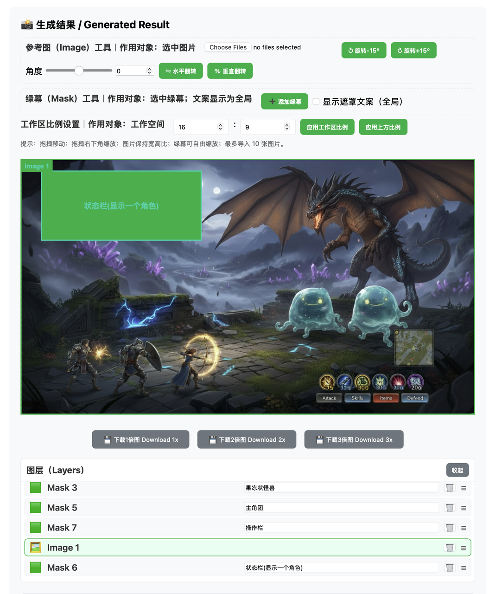

# Greenscreen Generator Project

This project is a greenscreen generator that allows users to create images with customizable aspect ratios. It is designed to be simple and user-friendly, making it easy for anyone to generate greenscreen images for various purposes.

## Live

- GitHub Pages: https://meomeo-dev.github.io/greenscreen-gh-pages/

## 案例展示

## Deploy (GitHub Actions)

- Workflow file: `.github/workflows/pages.yml`
- Triggers: push to `main` or manual dispatch
- Publishes the repository root directory to GitHub Pages

## License

This project is licensed under the MIT License. 